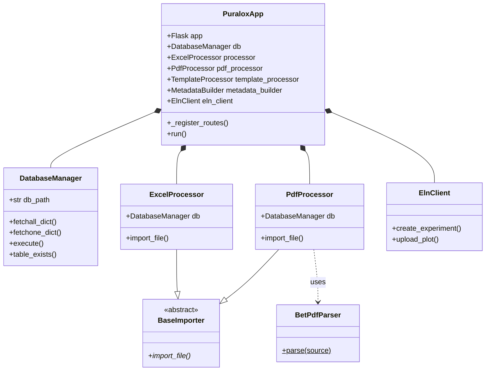

# Puralox — BET Data Processor & eLabFTW Integrator

Puralox is a high-performance laboratory automation platform designed to streamline the analysis and archival of BET (Brunauer-Emmett-Teller) scientific data. Built with Flask and a service-oriented architecture, it bridges the gap between raw instrument outputs (Excel/PDF) and digital laboratory notebooks (eLabFTW), ensuring data integrity and accessibility.

---

## 📋 Table of Contents

1.  [🚀 Key Features](#-key-features)
2.  [🛠️ Architecture & Design](#️-architecture--design)
    *   [Component Responsibilities](#component-responsibilities)
    *   [Class Diagram (Mermaid)](#class-diagram-mermaid)
3.  [🔄 Data Flow Lifecycle](#-data-flow-lifecycle)
4.  [📂 Project Structure](#-project-structure)
5.  [⚙️ Installation & Setup](#️-installation--setup)
    *   [Local Development](#local-development)
    *   [Docker Deployment](#docker-deployment)
6.  [🔌 API Reference](#-api-reference)
7.  [📊 Data Specification](#-data-specification)
    *   [Excel Schema](#excel-schema)
    *   [PDF Parser Engine](#pdf-parser-engine)
8.  [🗄️ Database Schema](#️-database-schema)
9.  [🔧 Configuration Reference](#-configuration-reference)
10. [❓ Troubleshooting & Support](#-troubleshooting--support)
11. [🤝 Contributing & Development](#-contributing--development)
12. [📜 License](#-license)

---

## 🚀 Key Features

*   **Multi-Source Data Ingestion**
    *   **Excel Importer:** Support for `.xlsx` reports with metadata, BET constants, technical parameters, and isotherm data points.
    *   **Scientific PDF Parser:** Advanced extraction via `PyMuPDF` for complex instrument-generated PDF reports, capturing BJH, t-plot, and multi-point BET summaries.
*   **Scientific Visualization Engine**
    *   Dynamic generation of **Isotherm (Adsorption/Desorption)** plots with linear regression.
    *   Support for specialized plots: **t-plot** and **BJH Pore Size Distribution**.
*   **eLabFTW v2 Integration**
    *   One-click archival to the Electronic Lab Notebook (ELN).
    *   Automatic HTML summary generation for the experiment body.
    *   Automated plot attachment and results tagging.
*   **Clean & Modular Design**
    *   1:1 module-to-class mapping ensuring 100% testability and separation of concerns.

---

## 🛠️ Architecture & Design

### Component Responsibilities

Puralox is built on a strictly decoupled architecture where each class has a singular responsibility:

| Class | Module | Role |
| :--- | :--- | :--- |
| **`PuraloxApp`** | `app.py` | The orchestrator. Handles Flask routing, session management, and cross-component coordination. |
| **`DatabaseManager`** | `database_manager.py` | The abstraction layer for SQLite3. Managed connection pooling, schema validation (`table_exists`), and dictionary-based fetching. |
| **`ExcelProcessor`** | `excel_processor.py` | Scientific logic for Excel data mapping. Inherits from `BaseImporter`. |
| **`PdfProcessor`** | `pdf_processor.py` | Orchestrates PDF ingestion, delegating the heavy lifting to `BetPdfParser`. |
| **`BetPdfParser`** | `bet_pdf_parser.py` | A utility-driven engine for regex-based and structural parsing of scientific text from PDFs. |
| **`ElnClient`** | `eln_client.py` | A high-level wrapper for the `elabapi-python` library, handling authentication, experiment creation, and file uploads. |
| **`TemplateProcessor`** | `template_processor.py` | The rendering engine. Converts database records into rich-text HTML using Jinja2 logic for ELN summaries. |
| **`MeasurementIdBuilder`** | `measurement_id_builder.py` | Enforces naming conventions across the project, generating unique IDs from sample/date/operator metadata. |
| **`MetadataBuilder`** | `metadata_builder.py` | Generates diagnostic and project-level metadata Excel files for tracking purposes. |

### Class Diagram (Mermaid)



---

## 🔄 Data Flow Lifecycle

1.  **Upload:** User selects a file (Excel/PDF) in the Web UI.
2.  **Ingestion:** `PuraloxApp` identifies the file type and routes it to `ExcelProcessor` or `PdfProcessor`.
3.  **Parsing:**
    *   `ExcelProcessor` reads specific cells (e.g., C2, H12).
    *   `PdfProcessor` calls `BetPdfParser` to run scientific regex patterns over the PDF text.
4.  **Identification:** `MeasurementIdBuilder` generates a unique analysis ID based on instrument metadata.
5.  **Persistence:** `DatabaseManager` saves records across five tables: `file_info`, `bet_params`, `tech_info`, `summaries`, and `data_points`.
6.  **Archival:** When "Push to eLabFTW" is triggered:
    *   `TemplateProcessor` builds the HTML body.
    *   `ElnClient` creates the experiment.
    *   A PDF report is generated containing plots and attached automatically.

---

## 📂 Project Structure

```text
puralox-app/
├── puralox/
│   ├── app.py                  # Entry orchestrator & Flask initialization
│   ├── base_importer.py        # Abstract contract for all data importers
│   ├── bet_pdf_parser.py       # Regex & structural PDF parsing core
│   ├── database_manager.py     # SQLite3 abstraction layer
│   ├── excel_processor.py      # Logic for Excel file scientific mapping
│   ├── pdf_processor.py        # Logic for PDF persistence and workflow
│   ├── eln_client.py           # eLabFTW API wrapper
│   ├── measurement_id_builder.py# Naming convention & ID generator
│   ├── template_processor.py   # HTML rendering for ELN (v2 API)
│   ├── metadata_builder.py     # Supporting metadata file generation
│   ├── config.py               # Centralized environment & file paths
│   ├── static/                 # CSS (vanilla), JS (Datatables/Chart.js)
│   └── templates/              # Jinja2 templates (index, file_view, api)
├── uploads/                    # Secure folder for uploaded files
├── run.py                      # Global entry point (Host: 0.0.0.0:2200)
├── requirements.txt            # Project dependencies
└── README.md                   # Technical Manual
```

---

## ⚙️ Installation & Setup

### Local Development

1.  **Prerequisites:** Python 3.10+, SQLite3.
2.  **Environment Setup:**
    ```bash
    git clone https://github.com/vitalybin/BET-Automation.git
    cd BET-Automation
    python -m venv venv
    venv\Scripts\activate  # Windows
    pip install -r requirements.txt
    ```
3.  **Configuration:**
    Create a `.env` file from the following template:
    ```env
    ELABFTW_URL=https://your-instance.com/api/v2
    ELABFTW_TOKEN=your_token_here
    ELABFTW_DISABLE_SSL=true
    DB_NAME=puralox.db
    UPLOAD_FOLDER=./uploads
    ```

### Docker Deployment

Use the provided `docker-compose.yml` to run Puralox alongside an eLabFTW instance or as a standalone app:
```bash
docker-compose up --build -d
```

---

## 🔌 API Reference

| Endpoint | Method | Params | Description |
| :--- | :--- | :--- | :--- |
| `/` | `GET` | - | Main upload dashboard. |
| `/files` | `GET` | - | Lists all indexed experiments. |
| `/file/<id>` | `GET` | `id` (int) | Detailed scientific view of a specific record. |
| `/push/<id>` | `POST` | `template_id` | Synchronizes the record with eLabFTW instance. |
| `/api/data/<id>`| `GET` | `id` (int) | Returns raw JSON of the entire analysis bundle. |
| `/api/elab/experiments`| `GET` | `limit` (opt) | Fetches recent experiments from your ELN instance. |

---

## 📊 Data Specification

### Excel Schema
The system expects a sheet named **"BET"**.
*   **Metadata:** Filename (C2), Method (C3), Operator (C4).
*   **BET Constants:** Specific Surface Area, C-Constant, correlation coefficient.
*   **Isotherm Data:** Columns starting from row 32 (Relative Pressure P/P₀, Quantity Adsorbed).

### PDF Parser Engine
The `BetPdfParser` uses structural blocks to identify instrument output. It is optimized for reports containing:
- "Full Report" headers.
- "BET Surface Area Report" tables.
- "Summary Report" key-value pairs.

---

## 🗄️ Database Schema

The SQLite schema is normalized to ensure data integrity:
*   **`file_info`**: Primary record containing the unique `measurement_id`.
*   **`bet_parameters`**: Scientific calculation results.
*   **`technical_info`**: Instrument settings (temperatures, gas types).
*   **`bet_data_points`**: Raw (x, y) coordinates for isotherm plots.
*   **`bet_summaries`**: Flexible key-value storage for varied instrument reports.

---

## ❓ Troubleshooting & Support

*   **PDF Parsing Failure?** Ensure the PDF is a "native" export from the instrument, not a scanned image. PyMuPDF requires selectable text.
*   **ELN Connection Error?** Check if `ELABFTW_DISABLE_SSL=true` is required for local certificates.
*   **Database Locked?** The integration uses `sqlite3.connect` with `PRAGMA foreign_keys = ON`. Ensure no other process is holding the `.db` file open.

---

## 📜 License

All rights of Code and Development belong to **KIT (Karlsruhe Institute of Technology)**.

---

*Project Maintenance & Lead Development: Rachit Jain (`rachitjain24`)*
