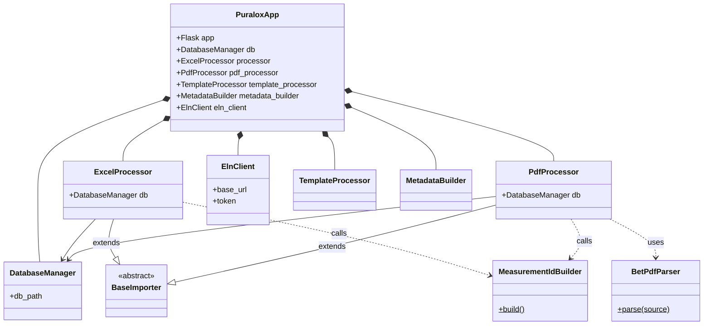

# Puralox — BET Data Processor & eLabFTW Integrator

A Flask application to:

1. Parse BET experiment data from Excel (`.xlsx`) and PDF files.
2. Store metadata, BET parameters, technical info and isotherm data points in SQLite.
3. Visualize and inspect data in a web UI.
4. Generate a PDF report containing the BET plot (with linear fit).
5. Push experiments—with rich-text summary, PDF attachment and tag—into your eLabFTW instance via its v2 API.

---

## 📋 Table of Contents

1. [Features](#features)  
2. [Prerequisites](#prerequisites)  
3. [eLabFTW Installation & Docker-Compose](#elabftw-installation--docker-compose)  
4. [Project Structure & Architecture](#project-structure--architecture)  
5. [Installation & Setup](#installation--setup)  
6. [Excel Input Format](#excel-input-format)  
7. [Running Locally](#running-locally)  
8. [Web UI Walkthrough](#web-ui-walkthrough)  
9. [API Endpoints](#api-endpoints)  
10. [PDF Reporting & Plotting](#pdf-reporting--plotting)  
11. [Docker & Docker-Compose (Puralox)](#docker--docker-compose-puralox)  
12. [Configuration Reference](#configuration-reference)  
13. [Database Schema](#database-schema)  
14. [Customization & Extension](#customization--extension)  
15. [Troubleshooting & FAQs](#troubleshooting--faqs)  
16. [Contributing](#contributing)  
17. [License](#license)  

---

## 🚀 Features

- **Excel & PDF → SQLite**  
  - Parses fixed "BET" Excel sheets or scientific PDF exports into metadata, parameters, technical info, and data points.
- **Rich Web UI**  
  - Upload files.
  - List processed files.
  - Inspect tables with DataTables.
- **Plot & PDF Report**  
  - Matplotlib scatter + linear fit.
  - ReportLab-generated PDF attachment.
- **eLabFTW Integration**  
  - Creates & patches experiments via API.
  - Attaches PDF.
  - Auto-tags `BET_result`.
  - Debug endpoint to fetch your last 10 experiments.

---

## 🔧 Prerequisites

- **Python 3.9+**  
- **SQLite** (bundled)  
- **PyMuPDF (`fitz`)**, **Pandas**, **Matplotlib**
- **eLabFTW** server (v2 API) & a personal access token  
- **Git**  
- (Optional) **Docker** & **Docker-Compose**

---

## 🖥️ eLabFTW Installation & Docker-Compose

Follow [https://doc.elabftw.net/](https://doc.elabftw.net/) for full installation. Here’s the official `docker-compose.yml` for eLabFTW:

```yaml
# docker-elabftw configuration file
# https://hub.docker.com/r/elabftw/elabimg/
networks:
  elabftw-net:

services:
  web:
    image: elabftw/elabimg:stable
    container_name: elabftw
    restart: always
    depends_on:
      mysql:
        condition: service_healthy
    security_opt:
      - no-new-privileges:true
    cap_drop:
      - ALL
    cap_add:
      - CHOWN
      - SETGID
      - SETUID
      - FOWNER
      - DAC_OVERRIDE
    environment:
      - DB_HOST=mysql
      - DB_PORT=3306
      - DB_NAME=elabftw
      - DB_USER=elabftw
      - DB_PASSWORD=VCYxpomuh4hCHrKITRQR0snVF10v2bv
      - PHP_TIMEZONE=Europe/Paris
      - TZ=Europe/Paris
      - SECRET_KEY=def00000ab4e1fac706e4bc31e3f1cdd…
      - SITE_URL=https://localhost
      - SERVER_NAME=localhost
      - DISABLE_HTTPS=false
      - ENABLE_LETSENCRYPT=false
    ports:
      - '443:443'
    volumes:
      - /var/elabftw/web:/elabftw/uploads
    networks:
      - elabftw-net

  mysql:
    image: mysql:8.0
    container_name: mysql
    restart: always
    healthcheck:
      test: "/usr/bin/mysql --user=$$MYSQL_USER --password=$$MYSQL_PASSWORD --execute 'SHOW DATABASES;'"
      interval: 5s
      timeout: 5s
      retries: 42
    cap_drop:
      - AUDIT_WRITE
      - MKNOD
      - SYS_CHROOT
      - SETFCAP
      - NET_RAW
    cap_add:
      - SYS_NICE
    environment:
      - MYSQL_ROOT_PASSWORD=WbeDStKG0X5Pj7qsHk5PRBzsXAqIWKw
      - MYSQL_DATABASE=elabftw
      - MYSQL_USER=elabftw
      - MYSQL_PASSWORD=VCYxpomuh4hCHrKITRQR0snVF10v2bv
      - TZ=Europe/Paris
    volumes:
      - /var/elabftw/mysql:/var/lib/mysql
    expose:
      - '3306'
    networks:
      - elabftw-net
```

Bring it up:

```bash
docker-compose up -d
```

---

## 📂 Project Structure & Architecture

The application has been refactored to follow a strictly decoupled, object-oriented 1:1 module-to-class structure:

```text
puralox-app/
├── puralox/
│   ├── app.py                  # PuraloxApp (Main core & routing)
│   ├── base_importer.py        # BaseImporter (Base abstract import contract)
│   ├── database_manager.py     # DatabaseManager (SQLite access layer)
│   ├── excel_processor.py      # ExcelProcessor (Excel → DB importer)
│   ├── pdf_processor.py        # PdfProcessor (PDF → DB orchestrator)
│   ├── bet_pdf_parser.py       # BetPdfParser (BET scientific PDF text extraction)
│   ├── eln_client.py           # ElnClient (eLabFTW HTTP network interactions)
│   ├── measurement_id_builder.py# MeasurementIdBuilder (Measurement ID naming convention)
│   ├── template_processor.py   # TemplateProcessor (Generates ELN HTML body)
│   ├── metadata_builder.py     # MetadataBuilder (Generates experiment tracking metadata Excel files)
│   ├── config.py               # UPLOAD_FOLDER, DB_NAME environment loaders
│   ├── templates/              # Jinja2 HTML views
│   └── static/                 # CSS/JS assets
├── uploads/                    # Saved `.xlsx` & `.pdf` (writable)
├── puralox.db                  # SQLite database (auto-created)
├── requirements.txt            # Python deps
├── Dockerfile                  # Puralox container
├── docker-compose.yml          # Combined eLabFTW & Puralox example
├── .env.example                # Env var template
└── README.md                   # ← You are here
```

### Class Architecture (Mermaid)

The application relies on decoupled services managed by a central application context, isolating data parsing from database logic and network calls.



---

## ⚙️ Installation & Setup

### 1. Clone & Virtualenv

```bash
git clone https://github.com/vitalybin/BET-Automation.git
cd BET-Automation
python3 -m venv .venv
source .venv/bin/activate
```

### 2. Install Dependencies

```bash
pip install --upgrade pip
pip install -r requirements.txt
```

`requirements.txt` includes:

```text
Flask
python-dotenv
pandas
numpy
matplotlib
requests
elabapi-python
reportlab
pymupdf
```

### 3. Configure Environment

Copy & edit `.env`:

```ini
ELABFTW_URL=https://localhost/api/v2
ELABFTW_TOKEN=your_access_token_here
#ELABFTW_DISABLE_SSL=true
```

Ensure `uploads/` is writable and `puralox.db` can be created.

---

## 📊 Excel Input Format

Your Excel must have a sheet named **BET** with:

| Field                 | Cell |
| --------------------- | ---- |
| file\_name            | C2   |
| date\_of\_measurement | C3   |
| time\_of\_measurement | C4   |
| comment1              | C5   |
| comment2              | C6   |
| comment3              | C7   |
| comment4 (equipment)  | C8   |
| serial\_number        | C9   |
| version               | C10  |

* **BET parameters**: rows 12–28, column C
* **Technical info**: rows 12–16, column H
* **Plot headers**: row 31
* **Data points**: rows 32+

If your layout differs, update `puralox/excel_processor.py`.

---

## ▶️ Running Locally

```bash
python run.py
```

Open → `http://localhost:2200` (or `http://localhost:5000` based on `run.py` config).

---

## 🌐 Web UI Walkthrough

1. **Home (`/`)**: Upload `.xlsx` or `.pdf`.
2. **Files (`/files`)**: List processed files.
3. **Detail (`/view/excel/<id>` or `/view/pdf/<id>`)**:

   * Metadata, parameters, tech info, data points.
   * "Push to eLabFTW" button with template assignments.

---

## 🔌 API Endpoints

| Method | Path                    | Description                              |
| ------ | ----------------------- | ---------------------------------------- |
| GET    | `/`                     | Upload form                              |
| POST   | `/`                     | Process uploaded file                    |
| GET    | `/files`                | List processed files                     |
| GET    | `/view/excel/<id>`      | View Excel-sourced file details          |
| GET    | `/view/pdf/<id>`        | View PDF-sourced file details            |
| GET    | `/api/data/<id>`        | Raw JSON of DB data                      |
| POST   | `/push/<id>`            | Push to eLabFTW, attach PDF & tag        |
| GET    | `/api/elab/experiments` | Fetch last 10 eLabFTW experiments (JSON) |
| GET    | `/api`                  | API info page                            |

---

## 📄 PDF Reporting & Plotting

* Uses **Matplotlib** for scatter + fit
* **ReportLab** wraps plot into a one-page PDF
* Uploaded to eLabFTW via `POST /experiments/{id}/uploads`

---

## 🐳 Docker & Docker-Compose (Puralox)

Add this to the same `docker-compose.yml` alongside eLabFTW:

```yaml
  puralox:
    build:
      context: ./
      dockerfile: Dockerfile
    image: puralox-app:latest
    container_name: puralox-app
    restart: always
    network_mode: host
    environment:
      - ELABFTW_URL=https://localhost/api/v2
      - ELABFTW_TOKEN=${ELABFTW_TOKEN}
      - ELABFTW_DISABLE_SSL=true
    volumes:
      - ./uploads:/usr/src/app/uploads
      - ./puralox.db:/usr/src/app/puralox.db
```

Then:

```bash
docker-compose up --build -d
```

---

## 🔧 Configuration Reference

| Variable              | Purpose                                        | Default                    |
| --------------------- | ---------------------------------------------- | -------------------------- |
| `ELABFTW_URL`         | eLabFTW API base URL (include `/api/v2`)       | `https://localhost/api/v2` |
| `ELABFTW_TOKEN`       | Your eLabFTW personal access token             | **(required)**             |
| `ELABFTW_DISABLE_SSL` | Skip SSL cert verification (`true` to disable) | `false`                    |
| `UPLOAD_FOLDER`       | Directory to save `.xlsx` / `.pdf`             | `./uploads`                |
| `DB_NAME`             | SQLite DB filename                             | `puralox.db`               |

---

## 🗄️ Database Schema

* **file\_info**: id, file\_name, date\_of\_measurement, time\_of\_measurement, comment1–5, serial\_number, version
* **bet\_parameters**: file\_info\_id, sample\_weight, … average\_pore\_diameter
* **technical\_info**: file\_info\_id, saturated\_vapor\_pressure, … num\_desorption\_points
* **bet\_plot\_columns**: file\_info\_id, col\_index, col\_name
* **bet\_data\_points**: file\_info\_id, no, p\_p0, p\_va\_p0\_p
* **bet\_summaries**: file\_info\_id, key, value (for PDF-extracted key/value data)

---

## 🔨 Customization & Extension

* **Excel parser** → `puralox/excel_processor.py`
* **PDF Parser** → `puralox/bet_pdf_parser.py`
* **Templates** → `templates/*.html` & `static/`
* **ELN HTML structure** → `puralox/template_processor.py`
* **Tags mapping** → `puralox/app.py` -> `_eln_push()`

---

## ❓ Troubleshooting & FAQs

* **SSL errors**: set `ELABFTW_DISABLE_SSL=true` in `.env`.
* **404 on `/push/…`**: ensure file is processed & correct ID.
* **400 Create failed**: inspect your generated HTML body payload logic.
* **Permission denied**: check `uploads/` directory & `puralox.db` write permissions.
* **Missing module `fitz`**: PyMuPDF was not found. Install with `pip install pymupdf`.

---

## 🤝 Contributing

1. Fork & clone
2. Branch: `git checkout -b feature`
3. Commit & push
4. PR

---

## 📜 License

License — All the rights of Code and Development belongs to KIT.

---

*For more details on eLabFTW setup, see* [https://doc.elabftw.net/](https://doc.elabftw.net/)
