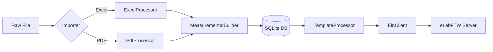

# Puralox — Technical Reference & Documentation

Puralox is a laboratory automation framework designed at **KIT (Karlsruhe Institute of Technology)**. It provides a robust, class-based infrastructure for parsing BET scientific data and synchronizing it with Electronic Lab Notebooks (ELN).

---

## 📋 Table of Contents

1.  [🔄 Refactoring Translation (Old vs New)](#-refactoring-translation-old-vs-new)
2.  [🛠️ Architecture & Core Classes](#️-architecture--core-classes)
    *   [PuraloxApp (Orchestrator)](#puraloxapp-orchestrator)
    *   [DatabaseManager (Persistence)](#databasemanager-persistence)
    *   [ElnClient (ELN v2 API)](#elnclient-eln-v2-api)
    *   [Data Importers (Excel & PDF)](#data-importers-excel--pdf)
    *   [Helper Entities (IDs & Templates)](#helper-entities-ids--templates)
3.  [📦 Dependencies & Roles](#-dependencies--roles)
4.  [🔄 Data Flow & Lifecycle](#-data-flow--lifecycle)
5.  [🔌 Detailed API Reference](#-detailed-api-reference)
6.  [🗄️ Database Schema Deep Dive](#️-database-schema-deep-dive)
7.  [⚙️ Installation & Configuration](#️-installation--configuration)
8.  [📜 License & Authorship](#-license--authorship)

---

## 🔄 Refactoring Translation (Old vs New)

The project underwent a significant structural audit to move from procedural scripts to a formal **1:1 Class-to-Module** architecture.

| Feature Area | Old Module (Procedural) | New Class (OOP) | New Module |
| :--- | :--- | :--- | :--- |
| **App Logic** | `app.py` | `PuraloxApp` | `puralox/app.py` |
| **Database** | `db_manager.py` | `DatabaseManager` | `puralox/database_manager.py` |
| **Nomenclature**| `nomenclature.py` | `MeasurementIdBuilder` | `puralox/measurement_id_builder.py` |
| **Excel Logic** | `excel_processor.py` | `ExcelProcessor` | `puralox/excel_processor.py` |
| **PDF Logic** | `bet_integration.py` | `BetPdfParser` | `puralox/bet_pdf_parser.py` |
| **ELN Client** | (Embedded in app) | `ElnClient` | `puralox/eln_client.py` |
| **Templates** | `eln_templates.py` | `TemplateProcessor` | `puralox/template_processor.py` |
| **Base Interface**| (None) | `BaseImporter` | `puralox/base_importer.py` |

---

## 🛠️ Architecture & Core Classes

### PuraloxApp (Orchestrator)
The central hub of the application. It initializes all service objects via dependency injection.
- **`__init__()`**: Injects `DatabaseManager` into all processors and sets up Flask routes.
- **`_eln_push(file_id)`**: Handles the multi-step transaction:
  1. Generates HTML summary.
  2. Creates ELN experiment.
  3. Generates/Uploads plot PDF.
  4. Tags the experiment.
- **`run()`**: Serves the application on port `2200`.

### DatabaseManager (Persistence)
A thread-safe wrapper for SQLite3 using dictionary-based results.
- **`fetchall_dict(sql, params)`**: Executes a query and returns a list of dictionaries (keys = column names).
- **`execute(sql, params)`**: Standard write operation; returns the `lastrowid`.
- **`table_exists(name)`**: Diagnostic tool used by `MetadataBuilder` and `PuraloxApp`.

### ElnClient (ELN v2 API)
Encapsulates all communication with the eLabFTW server. Uses official `elabapi-python`.
- **`create_experiment(title, body)`**: Creates a blank record and immediately patches it with scientific data.
- **`upload_plot(exp_id, file_id, pts, ...)`**: 
  - Uses `matplotlib` to render scientific plots in-memory.
  - Uses `ReportLab` to wrap the image in a PDF.
  - Uploads via `/uploads` endpoint.
- **`add_tag(exp_id, tag_name)`**: Applies searchable metadata tags to the ELN record.

### Data Importers (Excel & PDF)
Both importers inherit from the abstract **`BaseImporter`**.
- **`ExcelProcessor.import_file()`**: Parses the "BET" sheet using `pandas`. Targeted at specific cell coordinates for metadata.
- **`PdfProcessor.import_file()`**: Orchestrates the PDF workflow, calling `BetPdfParser` to extract raw text blocks.
- **`BetPdfParser.parse(text)`**: A static engine using complex regex to find Sample Weights, Surface Areas, and BJH table headers.

### Helper Entities
- **`MeasurementIdBuilder`**: Generates human-readable IDs (e.g., `SAM-2026-OP-INSTR`).
- **`TemplateProcessor`**: Builds the `body` of the ELN experiment using Jinja-style HTML logic.
- **`MetadataBuilder`**: Creates a side-car `.xlsx` file for every upload, containing a structured summary for local archival.

---

## 📦 Dependencies & Roles

| Package | Role in Puralox |
| :--- | :--- |
| **`Flask`** | Web framework and routing engine. |
| **`PyMuPDF` (`fitz`)**| Scientific PDF text/structure extraction. |
| **`Pandas`** | Excel processing and data-frame management. |
| **`Matplotlib`** | Core engine for Isotherm, t-plot, and BJH graphing. |
| **`ReportLab`** | Encapsulates matplotlib plots into formal PDF reports for ELN archival. |
| **`requests`** | REST communication with the eLabFTW API. |
| **`elabapi-python`** | Official eLabFTW SDK for experiment lifecycle. |
| **`python-dotenv`**| Secure management of ELN tokens and environment paths. |

---

## 🔄 Data Flow & Lifecycle

---

## 🔌 Detailed API Reference

| Endpoint | Method | Response | Logic Handler |
| :--- | :--- | :--- | :--- |
| `/` | `GET` | HTML | `upload()` |
| `/files` | `GET` | HTML | `list_files()` |
| `/view/excel/<id>`| `GET` | HTML | Render detailed Excel tables. |
| `/view/pdf/<id>` | `GET` | HTML | Render extracted PDF blocks. |
| `/push/<id>` | `POST` | JSON | `_eln_push()` orchestration. |
| `/api/data/<id>` | `GET` | JSON | `jsonify(self.db.fetchall_dict(...))` |

---

## 🗄️ Database Schema Deep Dive

### Table: `file_info`
*Primary metadata record.*
- `id`: PK
- `file_name`: Original file source.
- `date_of_measurement` / `time_of_measurement`: Extracted timestamps.
- `comment1-4`: General instrument comments.
- `comment5`: Stores the generated **Measurement ID**.

### Table: `bet_data_points`
*Raw (x, y) coordinates for plotting.*
- `p_p0`: Relative pressure.
- `p_va_p0_p`: Adsorbed volume derivative.

### Table: `bet_summaries`
*Flexible key-value pairs from PDF extraction.*
- `key`: Metadata identifier (e.g., `bjh:Total Volume`).
- `value`: Statistical result.

---

## ⚙️ Installation & Configuration

1. **Requirements**: `pip install -r requirements.txt`
2. **Setup**: Copy `.env.example` to `.env` and fill in `ELABFTW_TOKEN`.
3. **Execution**: `python run.py` (Production ready on port 2200).

---

## 📜 License & Authorship

Developed by **Rachit Jain (`rachitjain24`)** for the **Karlsruhe Institute of Technology (KIT)**. 
All rights reserved by KIT.
