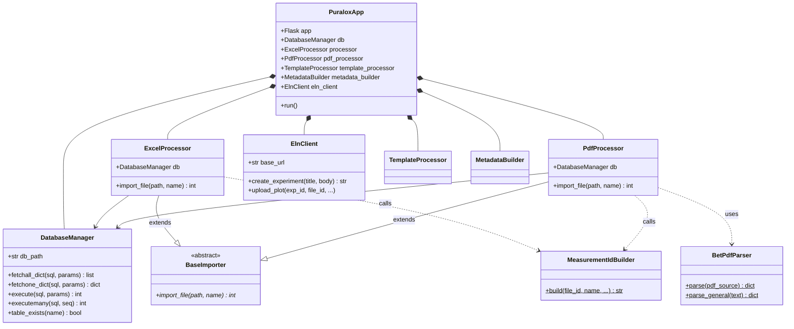

# Puralox — BET Data Processor & eLabFTW Integrator

Puralox is a laboratory automation platform built with Flask. Specialized in BET analysis processing, it automates the extraction, storage, visualization, and synchronization of data across two primary instrument outputs: Excel reports and BET PDF reports.

## 🚀 Core Features

- **Automated BET Data Extraction**
  - **Excel Parsing:** Extracts metadata (Sample ID, Operator, etc.), BET calculation parameters, technical info, and isotherm data points from `.xlsx` files.
  - **PDF Parsing (New):** Uses `PyMuPDF` (`fitz`) to extract comprehensive data from BET instrument PDF reports, including isotope summaries, multi-point BET results, t-plots, and BJH desorption tables.
- **Scientific Visualization**
  - Generates isotherm plots, t-plots, and BJH pore size distribution plots using `matplotlib`.
  - Detailed web UI to inspect every data point with `DataTables`.
- **eLabFTW Synchronization**
  - Full v2 API integration using `ElnClient`.
  - Creates experiments, patches rich-text summaries (ELN HTML), attaches generated PDF reports, and applies relevant tags (e.g., `BET_result`).
- **Clean Architecture**
  - 1:1 mapping between classes and modules for maximum maintainability.
  - Solid technical foundation with a clear UML class diagram.

---


---

## 🛠️ Architecture & Design

Puralox follows a decoupled, service-oriented architecture. Data extraction is handled by dedicated parsers, while business logic and database persistence are managed by processors.

### Class Diagram (Mermaid)



### Component Breakdown

- **`PuraloxApp`**: Main Flask orchestrator and router.
- **`DatabaseManager`**: Centralized SQLite interaction layer.
- **`ElnClient`**: Dedicated wrapper for the eLabFTW API.
- **`BetPdfParser`**: Specialized logic for scientific PDF extraction (PyMuPDF).
- **`ExcelProcessor` & `PdfProcessor`**: Specialized importers that handle database persistence, both inheriting from **`BaseImporter`**.
- **`MeasurementIdBuilder`**: Centralized logic for generating consistent measurement IDs.
- **`TemplateProcessor`**: Logic for generating the rich ELN HTML summary.
- **`MetadataBuilder`**: Generates metadata Excel sheets for experiment documentation.

---

## 📂 Project Structure

```text
puralox-app/
├── puralox/
│   ├── app.py                  # PuraloxApp (Routes & Logic)
│   ├── base_importer.py        # Abstract Base Class for file importers
│   ├── bet_pdf_parser.py       # BetPdfParser (PDF Parsing Logic)
│   ├── config.py               # Configuration & Environment loading
│   ├── database_manager.py     # DatabaseManager (SQLite helper)
│   ├── eln_client.py           # ElnClient (eLabFTW API operations)
│   ├── excel_processor.py      # ExcelProcessor (Excel → DB)
│   ├── measurement_id_builder.py# MeasurementIdBuilder (ID Generation)
│   ├── metadata_builder.py     # MetadataBuilder (.xlsx metadata gen)
│   ├── pdf_processor.py        # PdfProcessor (PDF → DB orchestration)
│   ├── template_processor.py   # TemplateProcessor (ELN HTML gen)
│   ├── static/                 # CSS/JS assets
│   └── templates/              # Jinja2 HTML views
├── uploads/                    # Writable folder for storage
├── run.py                      # Application entry point
├── .env                        # Local configuration (Ignored by Git)
├── .gitignore                  # Git exclusion rules
└── README.md                   # ← You are here
```

---

## ⚙️ Installation & Setup

### 1. Prerequisites
- **Python 3.10+**
- **PyMuPDF (`fitz`)**: For scientific PDF parsing.
- **SQLite3**

### 2. Setup environment
```bash
git clone https://github.com/vitalybin/BET-Automation.git
cd BET-Automation
python -m venv venv
source venv/bin/activate  # On Windows use: venv\Scripts\activate
pip install -r requirements.txt
```

### 3. Requirements
The platform requires the following core dependencies:
- `Flask`, `python-dotenv`
- `pandas`, `numpy`, `matplotlib`
- `requests`, `elabapi-python`
- `PyMuPDF` (installed as `pymupdf` or `fitz`)
- `python-docx`, `python-docx` (for DOCX export support)

---

## 🖥️ Configuration

Create a `.env` file in the root directory:

```env
UPLOAD_FOLDER=./uploads
DB_NAME=puralox.db
ELABFTW_URL=https://your-elab-instance.com/api/v2
ELABFTW_TOKEN=your_v2_personal_access_token
ELABFTW_DISABLE_SSL=true  # Set to false for production
```

---

## ▶️ How to Run

### Local Development
```bash
python run.py
```
The application will start on `http://127.0.0.1:2200` by default.

---

## 🗄️ Database Schema

Puralox maintains structured records for scientific analysis:
- **`file_info`**: Core metadata, ID tracking, and comments.
- **`bet_parameters`**: Scientific parameters like sample weight and specific constants.
- **`technical_info`**: Detailed instrument technical parameters.
- **`bet_summaries`**: Key-value data summaries for experiments.
- **`bet_data_points`**: Raw (P/P₀, Volume) pairs for isotherm plotting.

---

## 🤝 Contributing
1. Feature branch: `git checkout -b feature/name`
2. Commit: Always include a descriptive message.
3. Push to `Dev-C` or your relevant branch.
4. Open a Pull Request.

---

**KIT — Karlsruhe Institute of Technology**  
*Development and logic by Rachit Jain (`rachitjain24`)*
